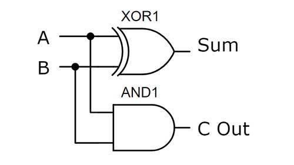
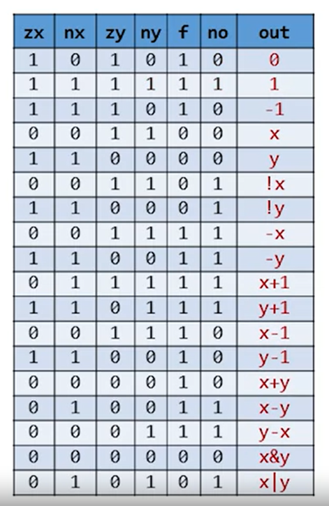
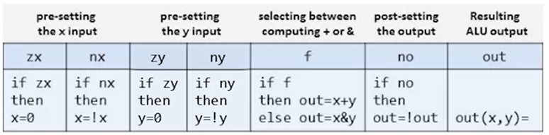
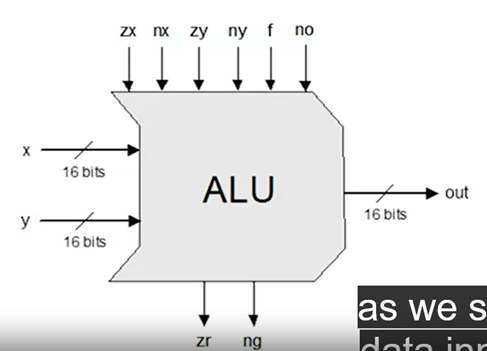

### **Half Adder**

###### **How It Works**

- it take `2 1-bit` input and output `1-bit sum` and `1-bit carry`

###### **Implementation**

- the `Sum` is Calculated using `XOR` Logic Gate of the `2 1-bit input`
- the `Carry` is Calculated using `And` Logic Gate of the `2 1-bit input`
  

### **Full Adder**

###### **How It Works**

- it take `3 1-bit` input and and output `1-bit sum` and `1-bit carry`

###### **Implementation**

- using [`2 Half Adder`](#half-adder) to calculate the `Sum` Value
- using `1 OR` Gate to calculate the `Carry Value`
- 

### **Add16**

###### **How It Works**

- it take `2 16-bit` input and Adds two's complement values.
- The most significant carry bit is ignored.

###### **Implementation**

- using [`16 Full Adder`](#full-adder)
- each `full adder` used to add 2 bit and output the carry so the next `full adder` will take the next two bit and the carry of the previous full adder

### **Inc16**

###### **How It Works**

- it take `16-bit` input and increment it
- `out` = `in` + `1`

###### **Implementation**

- using [`1 add16`](#add16) which take `2 input`
- where it's first input is `1` and the second input is `the gate input`

### **ALU**

###### **How It Works**

- it take `2 16-bit` input and compute one of the predefine functions function according to the `6 1-bit control input bits`
  
- in addition to calculate the 16-bit output it also computes `two output 1-bit`

  - if (out == 0) zr = 1, else zr = 0
  - if (out < 0) ng = 1, else ng = 0

- each control bit have a meaning according to the following table
  

###### **Implementation**

- see the code , it's more clear
- 
